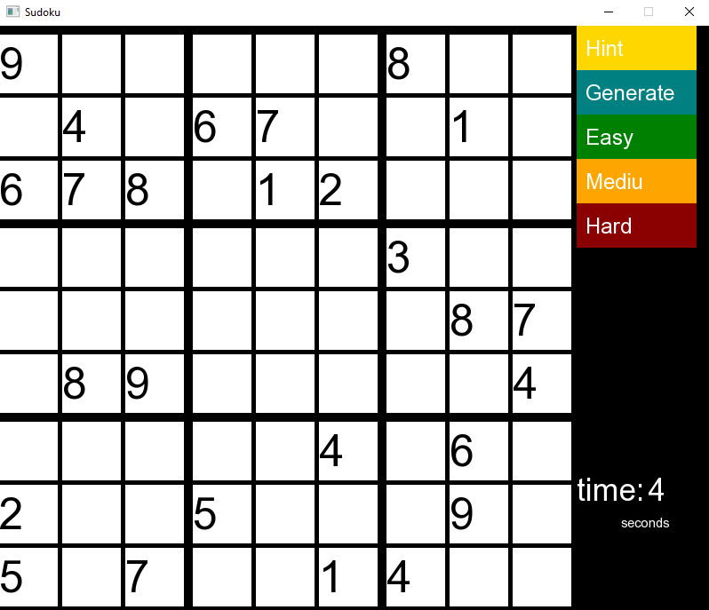

# Sudoku Game
This solution implements the basic functionality of the Sudoku game.
Various difficulty modes are provided, and a hint button is also provided.
The up down left right keys are provided to move around the playing field.
You can learn more about the game on Wikipedia.
The following methods were used to create this application.
* SFML
* C++
  
## Screenshot

